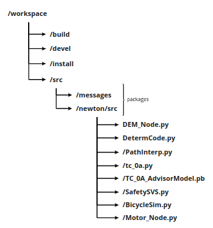

ROS
===
The NewtonRC utilizes a ROS network to connect RallyAI and the phsyical vehicle. The GWagon will have a similar network, but using ROS2. The connections consist of a network of nodes. Each node can publish information over a topic (think of this as a radio station) or subscribe to said topic.

Install ROS
-----------
To install ROS on your machine, follow the instructions `here <http://wiki.ros.org/melodic/Installation/Ubuntu>`_. RallyAI requires the ROS package to be at least the :code:`ros-melodic-desktop`. Once it is installed, we can begin setup.

.. note:: Please refer to `this <https://wiki.ros.org/ROS/Tutorials/InstallingandConfiguringROSEnvironment>`_ ROS tutorial if you have any problems with your installation or setup.

Setup ROS
---------
First, we need to :code:`source /opt/ros/melodic/setup.bash`. Initialize a workspace and within, create a directory named :code:`src`. Then, from within the workspace, initialize the workspace with :code:`catkin_make`. This generates the files necessary for a ROS workspace.

.. note:: Sourcing ROS is necessary in each new terminal that is opened. If you consider this to be annoying, as I do, you can add the source command directly to the bashrc file with :code:`echo "source /opt/ros/melodic/setup.bash" >> ~/.bashrc` (if using Ubuntu OS).

Now we can begin to build ROS packages inside the :code:`src/` directory. Each subdirectory here is considered a package and RallyAI has two such packages: :code:`~/ws/src/messages` and :code:`~/ws/src/newton`. In the following sections we outline each of these packages.

.. note:: In order for the files inside :code:`newton/` to access the msg files in :code:`messages/` we must source from the workspace directly with :code:`source ./devel/setup.bash`. This can also be added to the bachrc file with :code:`echo "source ~/ws/devel/setup.bash" >> ~/.bashrc`.

Custom Messages
---------------
The package :code:`~/ws/src/messages/` contains the messages for the :code:`~/ws/src/newton/` package. The repo can be found `here <https://github.com/Potential-Motors/messages>`_ and can be simply cloned into :code:`~/ws/src/.`. There exist standard messages built into the ROS package, like :code:`Int, Int8, Float32, String,` etc. However ROS also allows for the definition of custom messages which work consistently between Nodes, using Python or C. It also gives us the ability to label the data within the message. 

The messages include

+--------------+---------------------------------------------------------------------------------+
|   Message    | Description                                                                     |
+==============+=================================================================================+
| actions      | RallyAI output actions                                                          |
+--------------+---------------------------------------------------------------------------------+
| controls     | Message/actions sent to motors                                                  |
+--------------+---------------------------------------------------------------------------------+
| determ       | Determistic User actions                                                        |
+--------------+---------------------------------------------------------------------------------+
| joystick_user| User actions from joystick                                                      |
+--------------+---------------------------------------------------------------------------------+
| sim_states   | State, input for simulation                                                     |
+--------------+---------------------------------------------------------------------------------+
| states       | State/observations, input for RallyAI                                           |
+--------------+---------------------------------------------------------------------------------+
| user         | User actions from steering wheel/throttles                                      |
+--------------+---------------------------------------------------------------------------------+

To create a new custom message, follow these steps

1. Navigate to :code:`ws/src/messages/msg/`
2. Create a message file, :code:`cust_msg.msg`
 * Within the file list each data type and feature (i.e. :code:`dataType featureName`) on a new line
 * The 'dataType' can be anything from stdMsgs in ROS.
3. In the node file(s) that use :code:`type.msg`, add the line :code:`from messages.msg import type`
4. To initialize the message, write :code:`msg = cust_msg()`
5. To assign values to features, you can write :code:`msg.featureName = val`
 * Confirm the type of :code:`val` is the same as that of :code:`featureName`
6. Navigate to the workspace directory :code:`ws/` and run :code:`catkin_build`

Control Network
---------------
The package :code:`~/ws/src/newton/` contains the ROS nodes which comprise the nodes in the network. For this package, you will have to compile all the nodes seperately and build the package. This is explained in the section below. The list of nodes in this package are in the table below.

+--------------------------+-----------------------------------------------------------------------------------------+-------------------------------------------------+
|   Nodes                  | Description                                                                             | File Location                                   |
+==========================+=========================================================================================+=================================================+
| Driver Experience Module | Driver experience module, contains user input modules                                   | Potential-Motors/DEM/DEM_Node.py                |
+--------------------------+-----------------------------------------------------------------------------------------+-------------------------------------------------+
| Path Interpreter         | Inpterprets the path based off of the user inputs and current state of the vehicle      | Potential-Motors/Path-Interpreter/PathInterp.py |
+--------------------------+-----------------------------------------------------------------------------------------+-------------------------------------------------+
| Deterministic            | Deterministically controls the vehicle                                                  | Potential-Motors/Deterministic/DetermCode.py    |
+--------------------------+-----------------------------------------------------------------------------------------+-------------------------------------------------+
| RallyAI                  | Controls the vehicke using RallyAI                                                      | Potential-Motors/RallyAI_Node/tc_0a.py (tmp)    |
+--------------------------+-----------------------------------------------------------------------------------------+-------------------------------------------------+
| SafetySVS                | Accepts the actions from RallyAI and determines if they are safe                        | Potential-Motors/SafetySVS/SafetySVS.py         |
+--------------------------+-----------------------------------------------------------------------------------------+-------------------------------------------------+
| Simulation               | Contains the bicycle simulation for visualization, if not implemented/testing in Newton | N/A                                             |
+--------------------------+-----------------------------------------------------------------------------------------+-------------------------------------------------+
| Motor/Servo              | Sends controls to motor servos                                                          | N/A                                             |
+--------------------------+-----------------------------------------------------------------------------------------+-------------------------------------------------+

As mentioned above, these nodes communicate with one another by listening and sending information across `topics`. 

For example, one such topic is called the `/UserTopic` and the DEM node sends the driver's inputs across this signal. The path interpreter node listens to the same topic, and uses the information it recieves to compute the current path of the vehicle. To see the full network of topics and nodes, please checkout our miro board `ROS Architecture <https://miro.com/app/board/o9J_kurdiDQ=/?moveToWidget=3074457349396501557&cot=12>`_.

Below is a diagram of the Newton's ROS network, with topics and messages included. Nodes and topics in red have not yet been implemented.

.. image:: images/ROS_Newton_network.png
    :width: 900
    :align: center
    :target: https://miro.com/app/board/o9J_kurdiDQ=/?moveToWidget=3074457349436907449&cot=12
    :alt: ROS Network for Newton
    
Clicking on the image above sends you to the diagram on Miro.

Building Projects
-----------------
Inside the workspace dir :code:`~/ws/src/`, we will create a package using the command below.

.. code-block:: bash
    
    catkin_create_pkg proj_name rospy std_msgs messages
    
In our case, we chose the project name to be :code:`newton`. The strings following the project name consist of the packagesNow navigate to :code:`/newton/src/` and download the files from the node table above. Also download the weights for RallyAI that are also inside :code:`Potential-Motors/RallyAI_Node/` with the same name as the RallyAI node. 

After this step, the entire workspace should have the following structure.

Lastly, within :code:`~/ws/src/newton/`, we must edit two files (:code:`CMakeLists.txt` and :code:`package.xml`) to allow access to the custom messages.

Inside :code:`~/ws/src/newton/CMakteLists.txt`, there are a number of changes we need to make. Note that some of the functions need to be uncommented. Follow the list below.

1. Under the function :code:`find_package(...)`, add :code:`message_generation` and :code:`messages` within the brackets
2. Uncomment the function :code:`generate_messages` and the lines withing the brakctes
3. Inside the function :code:`catkin_package(...)` uncomment the line :code:`CATKIN_DEPENDS` and add :code:`message_runtime` to the end of the line

Inside :code:`~/ws/src/newton/package.xml`, we only need to uncomment the lines 

.. code-block:: bash

    <build_depend>message_generation</build_depend>
    ...
    <exec_depend>message_runtime</exec_depend>

Finally, we can back out to the workspace directory and run :code:`catkin_make`

Testing
-------
To run the entire network, please follow the commands below. Notice each numbered step requires it's own terminal window.

0. Run :code:`roscore`
1. Plug the steering wheel into your computer
 a. Run :code:`python DEM.py`
 b. Follow the instructions in the terminal
 c. The default driving mode is deterministic, please press the circle button to switch to AI mode
2. Run :code:`python PathInerp.py` 
3. Run :code:`python DetermCode.py`
4. Run :code:`python RallyAI_node.py`
 a. Replace :code:`RallyAI_node` with the test case you'd like to load in (i.e. :code:`tc_0a.py`)
5. Run :code:`python SafetySVS.py`
6. Run the simulation or hardware node
 a. (Sim)  Run :code:`python BicycleSim.py`
 b. (Real) Run :code:`python VHI_Beaglebone.py`

If everything is working properly, you should be able to control the simulation or Newton hardware from the steering wheel plugged into the computer. 

.. note:: To see what information is being sent over any topic, you can open a new terminal and simply write :code:`rostopic echo /ROSTopic` and insert any of the topics defined above.

